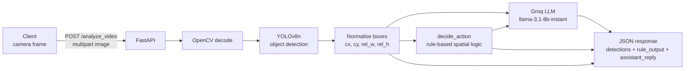

# Blind Navigation Assistant (PoC)

> Real-time obstacle awareness for visually impaired users: a camera frame goes in, a short spoken-style guidance sentence comes out.


---

## 🧭 Overview

This is a proof-of-concept backend for assistive navigation. A client (for example a phone camera or a Streamlit front end) posts a single image frame to a FastAPI endpoint. The service:

1. Detects objects with **YOLOv8n** (Ultralytics, COCO classes).
2. Normalises each bounding box into frame-relative position and size.
3. Runs a **rule-based spatial reasoning** step that keeps only *near* obstacles and groups them into people, vehicles and other objects.
4. Passes the detections and the rule output to **Llama 3.1 8B Instant on Groq**, which returns a very short (8–10 word) guidance phrase such as *"Person close in front"*.

## 🏗️ Architecture



## ✨ Features

- **Single-frame analysis API**: one endpoint that takes an image and returns detections plus guidance.
- **Proximity filtering**: an object counts as "near" only if its height is at least 22% of the frame and its centre sits in the lower part of the image (`cy >= 0.55`).
- **False-positive handling for people**:
  - a `person` below 65% confidence is downgraded to an unknown obstacle;
  - a very thin `person` box (width under 8% of the frame, e.g. a pole or bottle) is also treated as an unknown obstacle.
- **Obstacle grouping** into people, vehicles (`car`, `bus`, `truck`, `motorcycle`, `bicycle`) and other objects, with a readable summary like *"one person close ahead, 2 vehicles ahead. Move carefully."*
- **Ultra-short LLM phrasing**: the prompt limits replies to 8–10 words so they are quick to speak aloud.
- **CORS enabled** for all origins, so a separate front end can call the API directly.

## 🧰 Tech stack

| Layer | Tools |
|---|---|
| API | FastAPI, Uvicorn, python-multipart |
| Vision | Ultralytics YOLOv8n, OpenCV (headless), NumPy |
| Reasoning | Custom rule engine (`backend/logic.py`) |
| LLM | Groq API, `llama-3.1-8b-instant` |
| Config | python-dotenv |

## 📁 Project structure

```
blindpoc/
├── backend/
│   ├── main.py            # FastAPI app, /analyze_video endpoint, YOLO inference
│   ├── logic.py           # decide_action(): rule-based proximity and obstacle logic
│   ├── utils.py           # call_groq_llm(): Groq client and prompt
│   ├── requirements.txt
│   ├── .env.example
│   └── yolo/
│       └── yolov8n.pt     # YOLOv8 nano weights
├── .gitignore
└── README.md
```

## 🚀 Getting started

### Prerequisites

- Python 3.9+
- A [Groq API key](https://console.groq.com/keys)

### Install

```bash
git clone https://github.com/tyagipriyansh07/blindpoc.git
cd blindpoc

python -m venv .venv
# Windows
.venv\Scripts\activate
# macOS / Linux
source .venv/bin/activate

pip install -r backend/requirements.txt
```

### Configure

Copy the example file and add your key:

```bash
cp backend/.env.example .env
```

| Variable | Required | Description |
|---|---|---|
| `GROQ_API_KEY` | Yes | API key used by the Groq client in `backend/utils.py` |

`load_dotenv()` looks for `.env` in the current working directory (and its parents), so put it in the repo root if you run the server from there.

### Run

The app imports `backend.logic` and `backend.utils`, so start it from the **repo root**:

```bash
uvicorn backend.main:app --reload
```

The API runs at `http://127.0.0.1:8000`, with interactive docs at `/docs`.

> **Model path note:** `main.py` loads `YOLO("yolo/yolov8n.pt")` relative to the working directory, but the weights are stored at `backend/yolo/yolov8n.pt`. When you run from the repo root, copy the folder first (`cp -r backend/yolo ./yolo`) so the model is found.

## 📡 API reference

### `POST /analyze_video`

Analyses a single image frame.

**Request**: `multipart/form-data`

| Field | Type | Description |
|---|---|---|
| `image` | file | JPEG/PNG frame |

```bash
curl -X POST http://127.0.0.1:8000/analyze_video \
  -F "image=@frame.jpg"
```

**Response**: `200 OK`

```json
{
  "detections": [
    {
      "cls": "person",
      "conf": 0.87,
      "bbox": [412.3, 188.0, 590.1, 710.4],
      "cx": 0.78,
      "cy": 0.62,
      "rel_w": 0.28,
      "rel_h": 0.73
    }
  ],
  "rule_output": "one person close ahead. Move carefully.",
  "assistant_reply": "Person close in front, slow down."
}
```

| Field | Description |
|---|---|
| `detections[].cls` | YOLO class name |
| `detections[].conf` | Detection confidence (0–1) |
| `detections[].bbox` | `[x1, y1, x2, y2]` in pixels |
| `detections[].cx`, `cy` | Box centre as a fraction of frame width / height |
| `detections[].rel_w`, `rel_h` | Box size as a fraction of frame width / height |
| `rule_output` | Summary from the rule engine |
| `assistant_reply` | Short guidance phrase generated by the LLM |

*Values above are illustrative.*

### `GET /audio/{filename}`

Static file mount on the `audio/` directory, which is created on startup. Nothing writes to it yet (see below).

## ⚠️ Limitations and future work

- **Proof of concept.** No authentication or rate limiting, CORS is open to all origins, and it has no tests.
- **Single-frame, stateless.** Each request is analysed on its own, so there is no tracking, motion or direction estimation across frames.
- **Coarse spatial reasoning.** The rules use fixed thresholds tuned for a mobile camera and do not yet produce left/right/centre directions.
- **Audio output not wired up.** `gtts` is imported and `/audio` is mounted, but the endpoint does not generate speech yet. Adding text-to-speech for `assistant_reply` is the natural next step.
- **LLM latency and cost.** Every frame makes a Groq call, and a missing or invalid `GROQ_API_KEY` makes the request fail.
- **Front end not included.** The CORS comment refers to a Streamlit client, which is not in this repo.

## 👤 Author

**Priyansh Tyagi**, GenAI / ML Engineer

- GitHub: [@tyagipriyansh07](https://github.com/tyagipriyansh07)
- LinkedIn: [priyanshtyagi07](https://www.linkedin.com/in/priyanshtyagi07)
